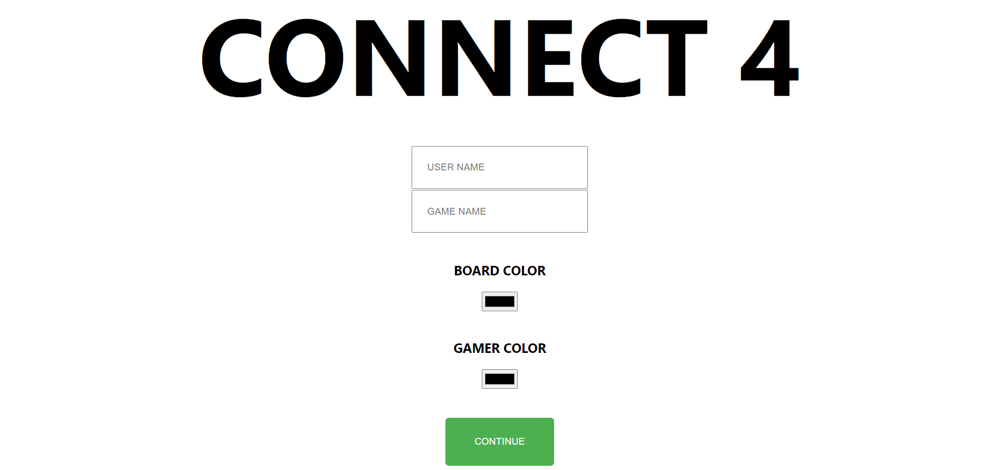
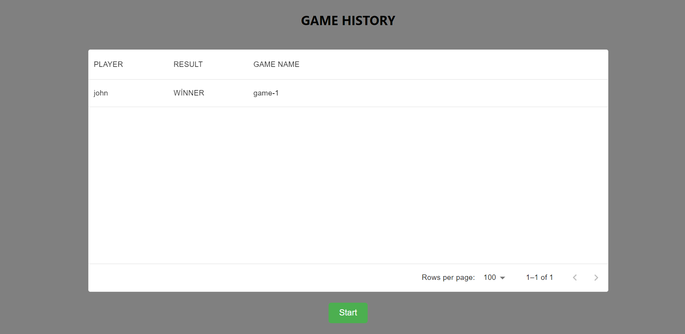
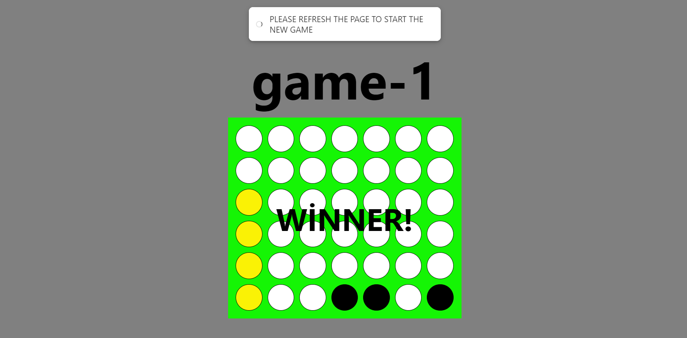

First of all, you can check out this game I made through this link[Connect 4](https://en.wikipedia.org/wiki/Connect_Four)

Almost the entire game has been developed using artificial intelligence (OpenAI: ChatGPT-3.5,4), which means you can experiment with AI to create games, applications, websites, and many other things without needing to know any programming languages.

You can start as follows: It's essential to prepare questions about your project in the finest detail for artificial intelligence!
1. Project Design:
Describe the basic rules and operation of the game.
Design the game's user interface (UI) or command line interface.

2. Preparing the Questions:
Prepare questions related to your project using ChatGPT-3.5,4. Learn how to submit these questions with ChatGPT.
Consider getting advanced answers by asking open-ended questions about the project.

3. Communication with ChatGPT:
Learn how to use the API to communicate with ChatGPT and plan how you will integrate ChatGPT with your project.
Consider how your project will handle questions and answers.

4. Data Entry and Game Logic:
Code the logic of the Connect 4 game. Describe how to place pieces and win the game.
Control the players' moves and how the pieces will be placed on the board.

5. Intelligence Development:
Improve the AI ​​side using ChatGPT. Have players offer strategic tips or move suggestions.
Create a constant feedback loop to ensure ChatGPT learns how to play the game better.

6. Testing and Development:
Test your game and fix bugs.
Regularly evaluate user feedback and ChatGPT's performance and make improvements.

[ChatGPT](https://chat.openai.com/share/7938fe01-643c-46a7-bfc8-d446269c2a71)

# Getting Started with Create React App 

This project was bootstrapped with [Create React App](https://github.com/facebook/create-react-app).

## Available Scripts

In the project directory, you can run:

### `npm start`

Runs the app in the development mode.\
Open [http://localhost:3000](http://localhost:3000) to view it in your browser.

The page will reload when you make changes.\
You may also see any lint errors in the console.

### `npm test`

Launches the test runner in the interactive watch mode.\
See the section about [running tests](https://facebook.github.io/create-react-app/docs/running-tests) for more information.

### `npm run build`

Builds the app for production to the `build` folder.\
It correctly bundles React in production mode and optimizes the build for the best performance.

The build is minified and the filenames include the hashes.\
Your app is ready to be deployed!

See the section about [deployment](https://facebook.github.io/create-react-app/docs/deployment) for more information.

### `npm run eject`

**Note: this is a one-way operation. Once you `eject`, you can't go back!**

If you aren't satisfied with the build tool and configuration choices, you can `eject` at any time. This command will remove the single build dependency from your project.

Instead, it will copy all the configuration files and the transitive dependencies (webpack, Babel, ESLint, etc) right into your project so you have full control over them. All of the commands except `eject` will still work, but they will point to the copied scripts so you can tweak them. At this point you're on your own.

You don't have to ever use `eject`. The curated feature set is suitable for small and middle deployments, and you shouldn't feel obligated to use this feature. However we understand that this tool wouldn't be useful if you couldn't customize it when you are ready for it.

# The interface of my game is like this, I gave brief information about the interface function.

 

## login screen

- State management for username, background color, game name, and player color using 'useState' hooks.
- The 'handleLogin' function saves the login information to 'localStorage' and completes the login process when the form is submitted.
- Background and player colors are retrieved and applied from 'localStorage' using the 'useEffect' hook on page load.
- The user interface is constructed within React JSX with style definitions.

 

## GameList screen

- The game history is managed with a 'useState' hook and initialized with data from 'localSt0orage'.
- The 'useEffect' hook is used to fetch the game history from 'localStorage' when the component loads.
- The game history is displayed in a table using the 'DataGrid' component.
- There's a button to start a new game, which redirects the user to the '/game' route.

## Game Screen

- Game board, player status, end-game conditions, and other game-related variables are managed with 'useState' hooks.
- Logic for winning, drawing, and making moves in the game is implemented through various functions.
- When the game ends, the game state is saved to 'localStorage' and tracked with 'useEffect' hooks.
- The game's visual interface is created with JSX and includes various CSS-in-JS style definitions.

## App.js

- Manages user session state using useState.
- Implements routing to paths like /login, /games, and /game using React Router.
- Displays different pages or redirects to specific routes based on the user's login status.
- Includes Login, GameList, and Game components and renders them on appropriate routes.

**Each file represents a different aspect of your React application, and together they create a comprehensive system allowing users to play games, view their game history, and make various settings.**

# Project Structure - Domain Driven Design 

my-react-project/
├── public/                # Folder for static assets
│   └── index.html         # Main HTML file
├── src/                   # Folder for source files
│   ├── screens/           # Screen components
│   │   ├── login/         # Components for the Login screen
│   │   │   ├── index.js   # Main file for the Login component
│   │   │   └── styles.js  # Style file for the Login screen
│   │   ├── gameList/      # Components for the Game List screen
│   │   │   ├── index.js   # Main file for the Game List component
│   │   │   └── styles.js  # Style file for the Game List screen
│   │   └── game/          # Components for the Game screen
│   │       ├── index.js   # Main file for the Game component
│   │       └── styles.js  # Style file for the Game screen
│   ├── components/        # Reusable components
│   ├── hooks/             # Custom React hooks
│   ├── utils/             # Utility functions
│   ├── App.js             # Main application component
│   └── index.js           # Entry point of the application
├── package.json           # Project dependencies and scripts
├── .gitignore             # Files to be ignored by Git
└── README.md              # Project documentation

